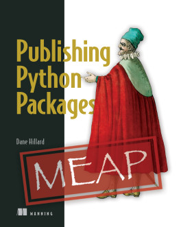

# Exercises for Publishing Python Packages: Test, share, and automate your projects 🐍 📦 ⬆️

This repository contains the source code for the examples and exercises contained in [_Publishing Python Packages: Test, share, and automate your projects_](https://pypackages.com). The repository is a template repository, so if you'd like to follow along with the book you can [make your own copy](https://github.com/daneah/publishing-python-packages/generate).

Each chapter's examples are in their own directory. In some chapters, you'll find multiple snippets in a single module. These won't always produce output when you run them, and are occasionally meant only as snippets to demonstrate a concept. In later chapters, some modules act as an entrypoint to run a program from the command line, importing other modules along the way. Follow along in the book for more context!

## Errata and questions

If you find an error in the code or the book, or if you have a question about the content, please read the [contribution guidelines](.github/CONTRIBUTING.md) to understand the best course of action. Errata found after the book has been printed will be published on [the book's homepage](https://pypackages.com).
